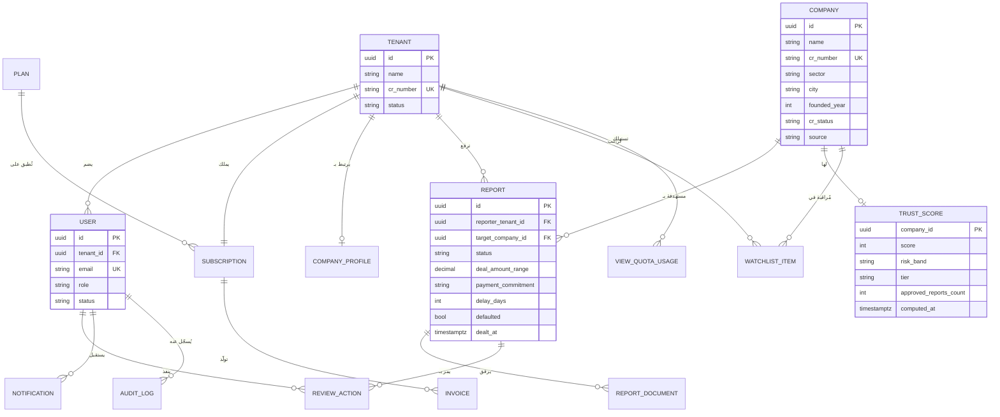

# مرصد (Marsad)
## منصة تقييم موثوقية الأعمال — B2B Business Trust Platform

**وثيقة المشروع الرسمية (Project Documentation & Source of Truth)**

| البند | التفاصيل |
|---|---|
| اسم المشروع | مرصد — منصة تقييم موثوقية الشركات |
| نوع المنتج | B2B SaaS — Multi-Tenant |
| السوق المستهدف | المملكة العربية السعودية |
| إصدار الوثيقة | v1.1 |
| تاريخ الإصدار | 9 يوليو 2026 |
| تاريخ التسليم المستهدف | **3 أغسطس 2026 (خلال 4 أسابيع)** |
| المرجعية التصميمية | Marsad Design System (ملف التصميم المعتمد Marsad.dc) |
| حالة الوثيقة | معتمدة — المرجع الرسمي للتطوير |
| آخر تحديث | حذف صفحة طلبات الأعمال (رقم التغيير الوحيد) |

---

## 5. نطاق المشروع (Project Scope)

## 5.1 داخل النطاق — النسخة الأولى (In Scope / MVP — تسليم 3 أغسطس 2026)

| المحور | التفاصيل |
|---|---|
| الموقع التعريفي | الرئيسية، عن المنصة، الباقات والأسعار، إنشاء حساب، تسجيل الدخول، تواصل معنا، الأسئلة الشائعة |
| لوحة الشركة | لوحة التحكم، البحث، تقرير الشركة (بحالات العرض الأربع)، إضافة شركة، معالج إضافة تقرير، تقاريري المرسلة، قوائم المراقبة، مقارنة الشركات، إدارة المستخدمين، الاشتراك والفواتير، الملف الشخصي والإشعارات |
| لوحة الإدارة | لوحة الإدارة، طابور مراجعة واعتماد التقارير، إدارة الشركات، إدارة المستخدمين، إدارة الاشتراكات والباقات، سجل العمليات، إعدادات النظام |
| المحرك | Trust Score Engine v1 (المواصفات في القسم 22) |
| البنية | Multi-Tenant + RBAC + Audit Logs + إشعارات داخل المنصة + رفع مستندات (S3) |
| الدفع | تكامل بوابة دفع واحدة (تُحدد مع العميل: Moyasar أو Tap) — اشتراكات شهرية |

## 5.2 خارج النطاق — النسخة الأولى (Out of Scope)

| البند | السبب | الموقع في الخارطة |
|---|---|---|
| الربط المباشر مع منصات حكومية (السجل التجاري الآلي) | يتطلب اتفاقيات وتصاريح؛ البيانات الرسمية تُدخل يدوياً/شبه آلي في v1 | المرحلة 2 |
| تطبيق جوال (iOS/Android) | الويب Responsive يغطي الحاجة الأولية | المرحلة 3 |
| Public API للعملاء | يتطلب نضج المنتج وتوثيق | المرحلة 2–3 |
| إشعارات SMS/WhatsApp | Email + In-App تكفي في v1 | المرحلة 2 |
| الذكاء الاصطناعي في تحليل التقارير | يحتاج بيانات تدريب متراكمة | المرحلة 3 |
| دعم لغات إضافية (الإنجليزية) | السوق المستهدف عربي أولاً | المرحلة 2 |

> **ملاحظة تعاقدية:** أي بند خارج هذا النطاق يُعامل كطلب تغيير (Change Request) بتقدير زمني ومالي مستقل، حمايةً لموعد التسليم المتفق عليه.

---

## 6. المتطلبات الوظيفية (Functional Requirements)

| الكود | المتطلب | الوصف | الأولوية |
|---|---|---|---|
| FR-01 | التسجيل والتحقق | إنشاء حساب شركة (بيانات المنشأة + السجل التجاري + مدير الحساب) مع تحقق بالبريد الإلكتروني | Must |
| FR-02 | المصادقة | تسجيل دخول JWT (Access + Refresh)، استعادة كلمة المرور، قفل الحساب بعد محاولات فاشلة | Must |
| FR-03 | تعدد المستأجرين | عزل كامل لبيانات كل شركة (Tenant) على مستوى قاعدة البيانات | Must |
| FR-04 | RBAC | خمسة أدوار بصلاحيات محددة (القسم 20) | Must |
| FR-05 | البحث عن الشركات | بحث بالاسم/السجل التجاري/القطاع/المدينة مع فلاتر ونتائج فورية | Must |
| FR-06 | تقرير الشركة | صفحة تقرير بأربع حالات عرض: موثوق / أولي / بيانات غير كافية / مقفل (باقة مجانية) | Must |
| FR-07 | إضافة شركة | طلب إضافة شركة غير موجودة (تخضع لموافقة الإدارة قبل الظهور) | Must |
| FR-08 | معالج إضافة تقرير | معالج متعدد الخطوات: بيانات التعامل، الالتزام بالسداد، التأخير، المستندات الداعمة، الإقرار | Must |
| FR-09 | مراجعة التقارير | طابور إداري: اعتماد / رفض مع سبب / طلب استكمال؛ لا يُحتسب أي تقرير قبل الاعتماد | Must |
| FR-10 | مؤشر الثقة | حساب آلي وفق مواصفات القسم 22، يُعاد حسابه عند كل اعتماد/إلغاء اعتماد | Must |
| FR-11 | إخفاء الهوية | عدم كشف هوية الشركة المُبلِّغة في أي واجهة أو API؛ إحصائيات مجمّعة فقط | Must |
| FR-12 | قوائم المراقبة | إضافة شركات لقائمة مراقبة مع إشعار عند تغير مؤشرها أو اعتماد تقرير جديد عنها | Must |
| FR-13 | مقارنة الشركات | مقارنة جنباً إلى جنب حتى 3 شركات (المؤشر، الالتزام، التأخير، التعثر) | Must |
| FR-14 | إدارة مستخدمي الشركة | دعوة موظفين، تعيين أدوار، تعطيل، ضمن حد الباقة | Must |
| FR-15 | الاشتراكات والفوترة | اختيار باقة، دفع إلكتروني، تجديد، ترقية/تخفيض، فواتير PDF | Must |
| FR-16 | رفع المستندات | رفع مستندات داعمة (PDF/صور) بحد أقصى 10MB للملف، تخزين S3 بروابط موقعة | Must |
| FR-17 | الإشعارات | إشعارات داخل المنصة + بريد إلكتروني للأحداث الجوهرية | Must |
| FR-18 | سجل العمليات | Audit Log غير قابل للتعديل لكل العمليات الحساسة (من فعل ماذا ومتى) | Must |
| FR-19 | إعدادات النظام | إدارة حدود الباقات، الحد الأدنى للتقارير، أوزان مؤشر الثقة، من لوحة الإدارة | Must |

---

## 10. حالات الاستخدام (Use Cases)

| الكود | الحالة | الفاعل | الشرط المسبق | التدفق الأساسي | النتيجة |
|---|---|---|---|---|---|
| UC-01 | إنشاء حساب شركة | زائر | لا يوجد حساب بنفس السجل التجاري | إدخال بيانات المنشأة والمدير ← تحقق بريد ← اختيار باقة | Tenant جديد نشط |
| UC-02 | تسجيل الدخول | مدير/موظف | حساب مفعّل | بريد + كلمة مرور ← JWT | جلسة نشطة |
| UC-03 | البحث عن شركة | مدير/موظف | اشتراك نشط | إدخال اسم/سجل ← فلاتر ← نتائج | قائمة شركات |
| UC-04 | عرض تقرير الثقة | مدير/موظف | ضمن حد الباقة الشهري | فتح صفحة الشركة ← تحميل الطبقات الثلاث | تقرير بحالة العرض المناسبة |
| UC-05 | إضافة تقرير تعامل | مدير/موظف | باقة تسمح بالرفع + وجود الشركة المستهدفة | معالج 4 خطوات ← إقرار ← إرسال | تقرير بحالة "قيد المراجعة" |
| UC-06 | مراجعة تقرير | إدارة/مراجع | تقرير قيد المراجعة | فحص البيانات والمستندات ← اعتماد/رفض/استكمال | تحديث الحالة + إعادة حساب المؤشر عند الاعتماد |
| UC-07 | إضافة شركة جديدة | مدير/موظف | الشركة غير موجودة | نموذج بيانات ← مراجعة إدارية | شركة قابلة للبحث |
| UC-08 | إدارة قائمة المراقبة | مدير/موظف | اشتراك يدعم الميزة | إضافة/إزالة شركة | إشعارات تلقائية عند التغير |
| UC-09 | مقارنة شركات | مدير/موظف | باقة Pro فأعلى | اختيار حتى 3 شركات | جدول مقارنة |
| UC-10 | دعوة مستخدم | مدير الشركة | ضمن حد الباقة | بريد + دور ← دعوة | مستخدم جديد بعد القبول |
| UC-11 | ترقية الاشتراك | مدير الشركة | باقة نشطة | اختيار باقة أعلى ← دفع الفرق | حدود جديدة فورية |
| UC-12 | تعليق شركة | إدارة المنصة | مخالفة قواعد | تعليق مع سبب | منع الدخول + تسجيل بالـ Audit |
| UC-13 | تعديل أوزان المؤشر | إدارة المنصة | صلاحية إعدادات | تعديل الأوزان ← تأكيد | إعادة حساب شاملة بالخلفية |

---

## 14. تصميم قاعدة البيانات (ERD)



---

## 15. جداول قاعدة البيانات (Database Tables)

| # | الجدول | الغرض | أهم الأعمدة |
|---|---|---|---|
| 1 | `tenants` | الشركات المشترِكة (المستأجرون) | id, name, cr_number, status, created_at |
| 2 | `users` | مستخدمو الشركات والإدارة | id, tenant_id (NULL للإدارة), email, password_hash, role, status, last_login_at |
| 3 | `companies` | الشركات موضوع التقييم | id, name, cr_number, sector, city, founded_year, cr_status, source (official/community), approved |
| 4 | `company_profiles` | ربط Tenant بملفه كشركة مُقيَّمة | tenant_id, company_id, claimed_at |
| 5 | `reports` | تقارير التعاملات | id, reporter_tenant_id, target_company_id, status, payment_commitment, delay_days, defaulted, deal_amount_range, dealt_at, submitted_at |
| 6 | `report_documents` | المستندات الداعمة | id, report_id, s3_key, mime, size, uploaded_by |
| 7 | `review_actions` | قرارات المراجعة | id, report_id, reviewer_id, action (approve/reject/request_info), reason, created_at |
| 8 | `trust_scores` | المؤشر المحسوب (Materialized) | company_id, score, risk_band, tier, approved_reports_count, breakdown (jsonb), computed_at |
| 9 | `plans` | الباقات وحدودها | id, name, price_monthly, limits (jsonb: views/month, users, watchlists, features) |
| 10 | `subscriptions` | اشتراكات الشركات | id, tenant_id, plan_id, status, current_period_start/end, gateway_ref |
| 11 | `invoices` | الفواتير | id, subscription_id, amount, vat, status, pdf_s3_key, issued_at |
| 12 | `watchlist_items` | قوائم المراقبة | id, tenant_id, company_id, list_name, created_by |
| 13 | `notifications` | الإشعارات | id, user_id, type, payload (jsonb), read_at, created_at |
| 14 | `audit_logs` | سجل العمليات (append-only) | id, actor_id, actor_role, action, entity, entity_id, meta (jsonb), ip, created_at |
| 15 | `view_quota_usage` | استهلاك حدود الاطلاع | tenant_id, period (YYYY-MM), views_count |
| 16 | `system_settings` | إعدادات قابلة للضبط | key, value (jsonb), updated_by, updated_at |

**سياسات على مستوى القاعدة:**
- **Row-Level Security (RLS)** على كل الجداول الحاملة لـ `tenant_id` — التفاصيل في القسم 21.
- فهارس: `companies(name gin_trgm)`, `companies(cr_number)`, `reports(target_company_id, status)`, `audit_logs(created_at)`, `notifications(user_id, read_at)`.
- `audit_logs`: صلاحية INSERT فقط لدور التطبيق — لا UPDATE/DELETE.

---

## 16. تصميم واجهات البرمجة (API Design)

**الأساس:** REST — إصدار عبر المسار `/api/v1` — JSON — توثيق تلقائي OpenAPI (Swagger) — مصادقة Bearer JWT.

| المجموعة | Endpoint | Method | الوصف | الصلاحية |
|---|---|---|---|---|
| Auth | `/auth/register` | POST | تسجيل شركة جديدة | عام |
| Auth | `/auth/login` | POST | تسجيل الدخول | عام |
| Auth | `/auth/refresh` | POST | تجديد التوكن | Refresh |
| Auth | `/auth/forgot-password` | POST | استعادة كلمة المرور | عام |
| Companies | `/companies` | GET | بحث بالشركات (q, sector, city, page) | شركة |
| Companies | `/companies` | POST | طلب إضافة شركة جديدة | شركة |
| Companies | `/companies/:id/report` | GET | تقرير الثقة (يطبق Gating تلقائياً) | شركة |
| Companies | `/companies/compare?ids=` | GET | مقارنة حتى 3 شركات | شركة (Pro+) |
| Reports | `/reports` | POST | إرسال تقرير تعامل | شركة |
| Reports | `/reports/mine` | GET | تقاريري المرسلة بحالاتها | شركة |
| Reports | `/reports/:id` | PATCH | تعديل تقرير مرفوض وإعادة إرساله | شركة (المالك) |
| Reports | `/reports/:id/documents` | POST | رفع مستند داعم (Presigned S3) | شركة (المالك) |
| Watchlist | `/watchlist` | GET/POST/DELETE | إدارة قوائم المراقبة | شركة |
| Team | `/team/users` | GET/POST/PATCH | إدارة مستخدمي الشركة | مدير شركة |
| Billing | `/billing/plans` | GET | الباقات المتاحة | عام |
| Billing | `/billing/subscribe` | POST | بدء عملية اشتراك/ترقية | مدير شركة |
| Billing | `/billing/invoices` | GET | الفواتير | مدير شركة |
| Billing | `/billing/webhook` | POST | Webhook بوابة الدفع | توقيع البوابة |
| Notifications | `/notifications` | GET/PATCH | جلب/تعليم كمقروء | مستخدم |
| Admin | `/admin/review-queue` | GET | طابور المراجعة | إدارة/مراجع |
| Admin | `/admin/reports/:id/decision` | POST | اعتماد/رفض/طلب استكمال | إدارة/مراجع |
| Admin | `/admin/companies` | GET/PATCH | إدارة الشركات (اعتماد إضافة/تعليق) | إدارة |
| Admin | `/admin/tenants` | GET/PATCH | إدارة المشتركين | إدارة |
| Admin | `/admin/plans` | GET/POST/PATCH | إدارة الباقات | إدارة |
| Admin | `/admin/settings` | GET/PATCH | إعدادات النظام (أوزان المؤشر، الحدود) | إدارة |
| Admin | `/admin/audit-logs` | GET | سجل العمليات مع فلاتر | إدارة |

**اصطلاحات موحدة:**
- الاستجابة: `{ data, meta }` والنجاح؛ `{ error: { code, message, details } }` للأخطاء — أكواد أخطاء ثابتة موثقة.
- Pagination موحد: `?page=&limit=` مع `meta.total`.
- Rate Limiting: 100 طلب/دقيقة للمستخدم (Redis)، وأشد على `/auth/*`.
- كل استجابات الشركات تمر عبر طبقة **Serialization** تضمن عدم تسرب أي حقل يكشف هوية المُبلِّغين (Defense in Depth فوق قواعد قاعدة البيانات).

---

## 18. هيكل المجلدات (Folder Structure)

```
marsad/
├── apps/
│   ├── web/                        # Next.js (App Router)
│   │   ├── app/
│   │   │   ├── (marketing)/        # الموقع التعريفي: /, about, pricing, faq, contact
│   │   │   ├── (auth)/             # login, register, forgot-password
│   │   │   ├── (company)/          # لوحة الشركة — Layout بالسايدبار الكحلي
│   │   │   │   ├── dashboard/  search/  companies/[id]/
│   │   │   │   ├── reports/new/  reports/mine/
│   │   │   │   ├── watchlist/  compare/
│   │   │   │   └── team/  billing/  profile/  notifications/
│   │   │   └── (admin)/            # لوحة الإدارة
│   │   │       ├── dashboard/  review-queue/  companies/
│   │   │       └── tenants/  plans/  audit-logs/  settings/
│   │   ├── components/ui/          # shadcn/ui مخصص بهوية مرصد
│   │   ├── components/features/    # TrustGauge, ReportWizard, CompareTable...
│   │   └── lib/                    # api client, auth, utils
│   └── api/                        # NestJS
│       ├── src/modules/
│       │   ├── auth/  tenants/  users/  companies/
│       │   ├── reports/  reviews/  trust-score/
│       │   ├── watchlist/
│       │   ├── billing/  notifications/  audit/  settings/
│       │   └── (كل موديول: controller / service / repository / dto / entities)
│       ├── src/common/             # guards, interceptors, filters, decorators
│       ├── src/queue/              # BullMQ processors: score-recompute, emails, invoices
│       └── prisma/                 # schema.prisma + migrations + seed
├── packages/
│   └── shared/                     # types + validation schemas (zod) مشتركة
├── docker/                         # Dockerfiles + compose للتطوير
├── .github/workflows/              # CI/CD
└── docs/                           # هذه الوثيقة + ADRs + Runbooks
```

---

## 20. مصفوفة الصلاحيات (Permission Matrix / RBAC)

| القدرة | زائر | موظف شركة | مدير شركة | مراجع | إدارة المنصة |
|---|:-:|:-:|:-:|:-:|:-:|
| تصفح الموقع التعريفي | ✔ | ✔ | ✔ | ✔ | ✔ |
| البحث وعرض تقارير الشركات | ✖ | ✔ | ✔ | ✖ | ✔ |
| رفع تقرير تعامل | ✖ | ✔ | ✔ | ✖ | ✖ |
| طلب إضافة شركة | ✖ | ✔ | ✔ | ✖ | ✔ |
| قوائم المراقبة | ✖ | ✔ | ✔ | ✖ | ✖ |
| مقارنة الشركات | ✖ | ✔* | ✔* | ✖ | ✔ |
| إدارة مستخدمي الشركة | ✖ | ✖ | ✔ | ✖ | ✖ |
| الاشتراك والفواتير | ✖ | ✖ | ✔ | ✖ | ✔ (عرض) |
| مراجعة واعتماد التقارير | ✖ | ✖ | ✖ | ✔ | ✔ |
| اعتماد إضافة الشركات | ✖ | ✖ | ✖ | ✔ | ✔ |
| إدارة الشركات (تعليق/تعديل) | ✖ | ✖ | ✖ | ✖ | ✔ |
| إدارة المشتركين والباقات | ✖ | ✖ | ✖ | ✖ | ✔ |
| إعدادات النظام وأوزان المؤشر | ✖ | ✖ | ✖ | ✖ | ✔ |
| سجل العمليات | ✖ | ✖ | ✖ | ✖ | ✔ |

*\* حسب الباقة (Pro فأعلى)*

---

## 35. مراحل التطوير (Development Phases)

| المرحلة | الأسبوع | المحتوى | مخرج نهاية المرحلة |
|---|---|---|---|
| **م1 — التأسيس** | الأسبوع 1 (3–10 يوليو) | Monorepo، Docker، CI/CD، Prisma Schema كامل + RLS، Auth (تسجيل/دخول/استعادة)، هيكل اللوحات الثلاث بالسايدبار المعتمد، الموقع التعريفي (7 صفحات من التصميم) | Staging يعمل: تسجيل ودخول فعلي + موقع تعريفي كامل |
| **م2 — قلب المنتج** | الأسبوع 2 (11–18 يوليو) | إدارة الشركات، البحث، صفحة التقرير بالحالات الأربع، معالج إضافة التقرير + رفع المستندات، تقاريري المرسلة، محرك المؤشر v1 + طابور إعادة الحساب | الرحلة الذهبية تعمل: بحث → تقرير → رفع تقرير |
| **م3 — الإدارة والتجارة** | الأسبوع 3 (19–26 يوليو) | لوحة الإدارة كاملة (المراجعة، الشركات، المشتركون، الباقات، الإعدادات، Audit)، الاشتراكات + بوابة الدفع + الفواتير، قوائم المراقبة، المقارنة، إدارة مستخدمي الشركة، الإشعارات | دورة كاملة: اشتراك مدفوع + اعتماد إداري يغيّر المؤشر |
| **م4 — الصقل والإطلاق** | الأسبوع 4 (27 يوليو – 3 أغسطس) | اختبارات E2E، فحص أمان وعزل، ضبط أداء، تجاوب الجوال، UAT مع العميل، إصلاحات، بيانات الإطلاق، نشر Production | **تسليم إنتاجي 3 أغسطس 2026** + محضر قبول |

---

## 37. المخرجات (Deliverables)

| # | المخرج | الوصف | موعد التسليم |
|---|---|---|---|
| D1 | هذه الوثيقة معتمدة وموقعة | المرجع الرسمي | 5 يوليو 2026 |
| D2 | بيئة Staging عاملة | رابط + حسابات تجريبية | 10 يوليو 2026 |
| D3 | نسخة قلب المنتج على Staging | البحث/التقرير/المعالج/المؤشر | 18 يوليو 2026 |
| D4 | النسخة المتكاملة على Staging | كل الشاشات + الدفع | 26 يوليو 2026 |
| D5 | تقرير الاختبارات والأمان | نتائج E2E + فحص العزل | 31 يوليو 2026 |
| D6 | **الإطلاق الإنتاجي** | النظام حي على نطاق العميل | **3 أغسطس 2026** |
| D7 | حزمة التسليم | الكود الكامل (مستودع بملكية العميل)، توثيق API (Swagger)، دليل تشغيل ونشر (Runbook)، دليل استخدام لوحة الإدارة، بيانات الاعتماد والأسرار مسلّمة بأمان | 3 أغسطس 2026 |
| D8 | فترة ضمان | إصلاح العيوب (Bugs) دون ميزات جديدة | 30 يوماً بعد الإطلاق |

---

## قائمة الشاشات المرجعية (مطابقة للتصميم المعتمد)

| النطاق | الشاشات |
|---|---|
| الموقع التعريفي (5+2) | الرئيسية، عن المنصة، الباقات، إنشاء حساب، تسجيل الدخول — إضافة إلى: تواصل معنا، الأسئلة الشائعة (تُبنى بنفس نظام التصميم) |
| لوحة الشركة (11) | لوحة التحكم، البحث، تقرير الشركة (4 حالات)، إضافة تقرير (معالج)، تقاريري المرسلة، قوائم المراقبة، مقارنة الشركات، إدارة المستخدمين، الاشتراك، الملف الشخصي/الإشعارات، إضافة شركة (ضمن البحث) |
| لوحة الإدارة (6) | لوحة الإدارة، طابور المراجعة، إدارة الشركات، إدارة (المشتركون/المستخدمون/الباقات — تبويبات)، سجل العمليات، الإعدادات |

---

*هذه الوثيقة هي المرجع الرسمي (Source of Truth) لمشروع مرصد v1. أي تعارض بين هذه الوثيقة وأي اتصال آخر، تسود هذه الوثيقة ما لم يُعتمد التعديل كتابياً.*

**آخر تحديث:** 9 يوليو 2026 — حذف صفحة طلبات الأعمال
