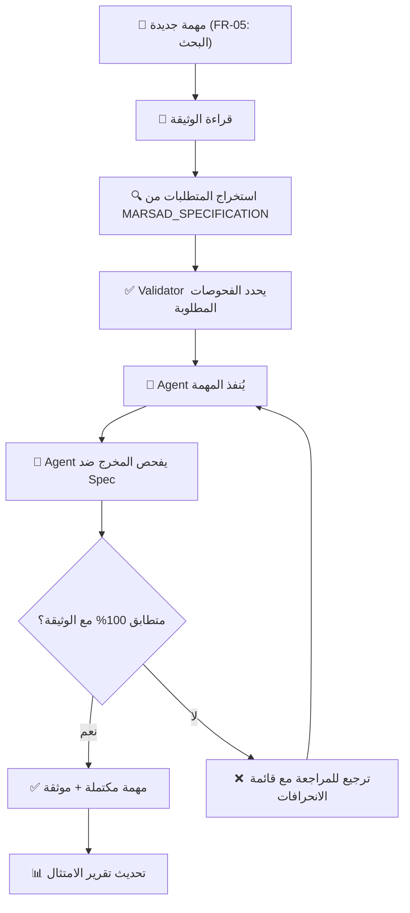

# 🎯 نظام الـ Agents المرتكز على الوثيقة الرسمية
## Specification-Driven Development with Autonomous Agents

**تاريخ الإنشاء:** 2026-07-13  
**النموذج:** Spec-First Development  
**الهدف:** بناء Marsad وفقاً **بنسبة 100%** للوثيقة الرسمية بدون انحرافات

---

## 📌 المشكلة التي حلّناها

**السابق:** النظام الأول (Bootstrap) كان يعمل بناءً على فهم عام للمشروع.

**الآن:** النظام الجديد يعمل بناءً على **وثيقة المشروع الرسمية** (MARSAD_PROJECT_SPEC.md) كـ Source of Truth.

---

## 🏗️ كيف يعمل النظام الجديد

### 1. **SPECIFICATION_MANIFEST.ts**
ملف TypeScript يحتوي على **كل الوثيقة** بصيغة منظمة:
- 25 شاشة محددة بدقة
- 20 متطلب وظيفي (FR)
- 10 متطلبات غير وظيفية (NFR)
- 11 قاعدة عمل حرجة (BR)
- معمارية كاملة
- جدول زمني دقيق (4 أسابيع)

### 2. **SpecificationValidator.ts**
أداة تحقق من **التزام كل مخرج بالوثيقة**:
- ✅ هل هذه الشاشة موجودة في الوثيقة؟
- ✅ هل هذا المتطلب الوظيفي مُنفذ؟
- ✅ هل قاعدة العمل هذه معمول بها؟
- ✅ هل الأمان يتطابق مع المتطلبات؟
- ✅ هل التصميم يتبع Tajawal + RTL + الألوان المعتمدة؟

### 3. **أربع Agents متخصصة**

كل Agent لها **دور واحد واضح** وتحقق من المخرجات مقابل الوثيقة:

#### **Backend Engineer Agent**
```
المسؤولية: بناء API وقاعدة البيانات وفقاً للوثيقة
الفحوصات:
  ✅ كل Endpoint في Spec موجود؟
  ✅ Database tables match ERD؟
  ✅ RLS لكل جدول tenant_id؟
  ✅ Trust Score calculation exact?
  ✅ OWASP + BR compliance?
```

#### **Frontend Engineer Agent**
```
المسؤولية: بناء UI Screens وفقاً للتصميم المعتمد
الفحوصات:
  ✅ كل 25 شاشة موجودة؟
  ✅ Tajawal + RTL على كل شاشة؟
  ✅ الألوان تطابق Design System؟
  ✅ حالات التقرير الأربع صحيحة؟
  ✅ Gating (باقة مجانية) صحيح؟
```

#### **Security Engineer Agent**
```
المسؤولية: التحقق من الأمان والخصوصية
الفحوصات:
  ✅ OWASP Top 10 مُغطّى؟
  ✅ RLS يعزل Tenants؟
  ✅ هوية المُبلِّغ محمية (0% exposure)?
  ✅ Audit Log غير قابل للتعديل؟
  ✅ كل الأسرار في AWS Secrets Manager؟
```

#### **QA Engineer Agent**
```
المسؤولية: اختبار الرحلات الذهبية والحدود الدنيا
الفحوصات:
  ✅ تسجيل → اشتراك ← يعمل نهاية لنهاية؟
  ✅ بحث → تقرير بحالاته الأربع؟
  ✅ رفع تقرير → اعتماد → تغيير المؤشر؟
  ✅ عزل Tenant: مستخدم A لا يرى بيانات B؟
  ✅ Gating: باقة مجانية لا ترى المؤشر؟
```

---

## 🔄 دورة حياة المهمة (Task Lifecycle)



---

## 💾 ملفات النظام الجديد

```
C:\Users\DTG\marsd\
├── MARSAD_PROJECT_SPEC.md              ← الوثيقة الرسمية كاملة (مرجع)
├── agents/
│   ├── spec/
│   │   ├── SPECIFICATION_MANIFEST.ts   ← كل الوثيقة بصيغة TS
│   │   └── SpecificationValidator.ts   ← أداة التحقق من الامتثال
│   ├── core/
│   │   └── BaseAgent.ts               ← محدّث: يستخدم Validator
│   ├── backend/
│   │   └── BackendEngineer.ts         ← محدّث: يتحقق من API spec
│   ├── frontend/
│   │   └── FrontendEngineer.ts        ← محدّث: يتحقق من screens + design
│   ├── security/
│   │   └── SecurityEngineer.ts        ← محدّث: يتحقق من OWASP + RLS + خصوصية
│   ├── qa/
│   │   └── QAEngineer.ts              ← محدّث: يختبر الرحلات الذهبية
│   └── orchestrator/
│       └── AgentOrchestrator.ts       ← محدّث: يوزع المهام وفقاً للوثيقة
```

---

## 🚀 كيفية استخدام النظام

### الخطوة 1: استخدام Spec Manifest
```typescript
import { MARSAD_SPECIFICATION } from './agents/spec/SPECIFICATION_MANIFEST'

// احصل على أي معلومة من الوثيقة
const screen = MARSAD_SPECIFICATION.screens.company[0]
console.log(screen.name) // "لوحة التحكم"
console.log(screen.path) // "/company/dashboard"

const fr = MARSAD_SPECIFICATION.functionalRequirements.FR05
console.log(fr) // "Company search (name/CR/sector/city with filters)"

const br = MARSAD_SPECIFICATION.businessRules.BR02
console.log(br) // "Reporter identity NEVER exposed..."
```

### الخطوة 2: إنشاء مهمة وتعيينها للـ Agent المناسب
```typescript
import { TaskBuilder } from './agents/orchestrator/AgentOrchestrator'

const task = new TaskBuilder(
  'Implement FR-05: Company Search',
  'Add full-text search by name/CR/sector/city'
)
  .setPriority('critical')
  .addSpecRequirement('FR-05', MARSAD_SPECIFICATION.functionalRequirements.FR05)
  .addSpecRequirement('BR-05', MARSAD_SPECIFICATION.businessRules.BR05)
  .addSecurityCheck('owasp-top10', 'SQL Injection Prevention via Prisma', 'critical')
  .addSecurityCheck('multi-tenant', 'Ensure search results filtered by tenant_id', 'critical')
  .build()

await orchestrator.assignTask(task)
```

### الخطوة 3: Agent ينفذ المهمة ويتحقق من الامتثال
```typescript
// داخل BackendEngineer.executeTaskLogic()
const validator = new SpecificationValidator()

// بناء الـ Search Endpoint
const searchEndpoint = await this.buildSearchEndpoint()

// التحقق من الامتثال
validator.validateFR('FR05', true, `Endpoint: GET /companies?q=&sector=&city=`)
validator.validateOWASPCoverage('SQL Injection', true, 'Prisma parameterized queries')
validator.validateMultiTenantIsolation(true, true)

// إذا كانت كل الفحوصات بـ PASS، المهمة مكتملة
// إذا كانت أي فحص بـ FAIL، تُرجع المهمة مع أسباب الرفض
```

### الخطوة 4: عرض تقرير الامتثال
```typescript
const report = validator.getComplianceReport()
console.log(`
Compliance: ${report.compliancePercentage.toFixed(1)}%
Passed: ${report.passed}/${report.totalChecks}
Failed: ${report.failed}
`)

validator.printReport() // طباعة تقرير شامل
```

---

## 📊 تقارير الامتثال

بعد إنهاء كل مرحلة (week 1–4)، يُطبع تقرير شامل:

```
╔════════════════════════════════════════════════════════════════════════════╗
║                                                                            ║
║              📋 MARSAD SPECIFICATION COMPLIANCE REPORT                   ║
║                                                                            ║
╚════════════════════════════════════════════════════════════════════════════╝

📊 SUMMARY
──────────────────────────────────────────────────────────────────────────────
Total Checks:         127
✅ Passed:            125
❌ Failed:            2
⚠️  Partial:          0
❓ Not Tested:        0
📈 Compliance:        98.4%

SCREENS
──────────────────────────────────────────────────────────────────────────────
✅ Screen 1: الرئيسية
✅ Screen 2: عن المنصة
❌ Screen 8: لوحة التحكم — ISSUE: Missing "recent activity" widget
   Action: Add widget per design spec
...
```

---

## 🎯 معايير النجاح

كل مرحلة تُعتبر **ناجحة** إذا:

| المعيار | النسبة |
|---|---|
| ✅ امتثال الوثيقة | ≥ 99% |
| ✅ E2E tests passing | 100% |
| ✅ No 5xx errors | 0 |
| ✅ Performance P95 ≤ 300ms | True |
| ✅ RLS isolation verified | ✅ |
| ✅ Reporter anonymity | ✅ |
| ✅ OWASP coverage | 10/10 |
| ✅ Design spec compliance | 100% |

---

## 🔒 قفل الامتثال (Spec Lock)

**قاعدة ذهبية:** بمجرد الموافقة على MARSAD_PROJECT_SPEC.md، أي انحراف عنها يتطلب:
1. تعديل رسمي للوثيقة (Change Request)
2. موافقة كتابية من مالك المنتج
3. تعديل الجدول الزمني إن لزم

---

## 📝 الفرق بين النسختين

| الجانب | الإصدار الأول (Bootstrap) | الإصدار الجديد (Spec-Driven) |
|---|---|---|
| المرجع | فهم عام للمشروع | وثيقة رسمية (MARSAD_PROJECT_SPEC.md) |
| الفحوصات | عامة | محددة من الوثيقة (FR, BR, NFR, Security) |
| التحقق | يدوي أثناء التنفيذ | آلي عبر SpecificationValidator |
| الامتثال | غير مقاس | % مرئية (compliance %age) |
| الانحرافات | قد تمر بدون اكتشاف | تُكتشف وتُرجع المهمة |
| التوثيق | بعد الإنتهاء | قبل البدء (من الوثيقة) |

---

## 🚨 الخطوات التالية

### الآن (أسبوع 1):
1. قراءة MARSAD_PROJECT_SPEC.md كاملة
2. فهم SPECIFICATION_MANIFEST structure
3. معاينة SpecificationValidator
4. بدء Bootstrap الجديد

### أسبوع 1–4:
1. كل Agent يعمل مستقلاً لكن يفحص مقابل الوثيقة
2. كل مهمة مكتملة = compliance ✅
3. في نهاية كل أسبوع: تقرير امتثال شامل

### التسليم (3 أغسطس):
- ✅ 25/25 شاشات
- ✅ 20/20 متطلب وظيفي
- ✅ 99%+ امتثال
- ✅ محضر قبول موقّع من العميل

---

**هذا النظام يضمن: لن نبني شيئاً غير موجود في الوثيقة، ولن نترك شيئاً من الوثيقة بدون بناء.**

**شعار الفريق:** *من الوثيقة وفقط من الوثيقة* 📖
